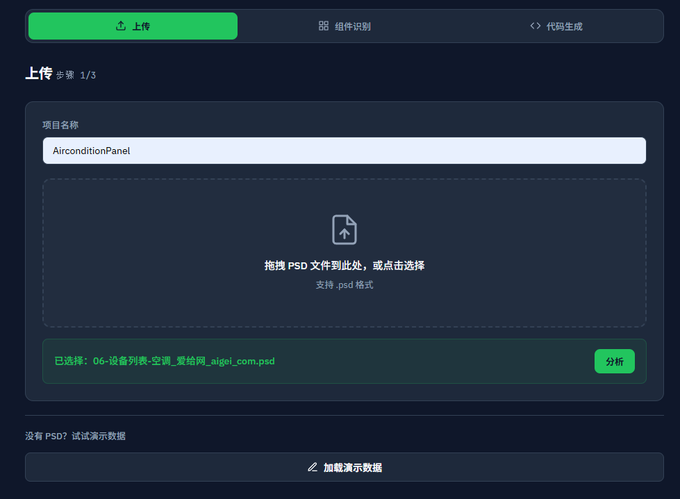
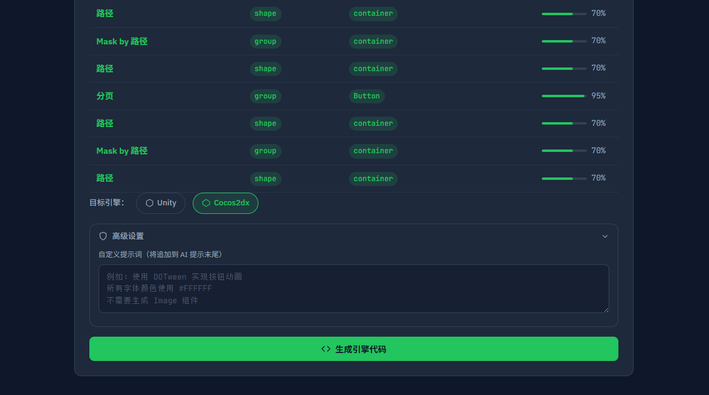
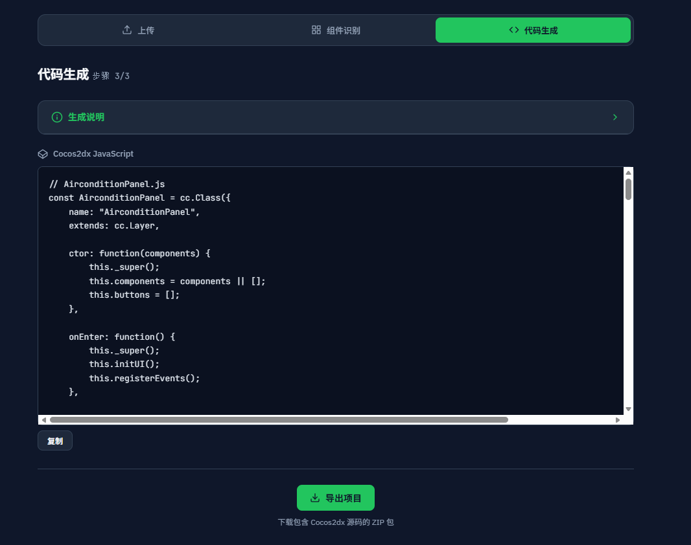

# AI UI Pipeline — PSD → Unity / Cocos2dx

使用 DeepSeek AI 将 PSD 设计稿自动转为 Unity C# 和 Cocos2dx JavaScript 代码。

> 开发者文档参见 [DEVELOPER.md](DEVELOPER.md)

## 快速开始

```bash
pip install -r requirements.txt
$env:DEEPSEEK_API_KEY = "sk-..."   # PowerShell
python backend_api.py               # 访问 http://localhost:8000
```

## 项目结构

```
UIGenPipeline/
├── backend_api.py    # FastAPI 服务（PSD解析 + AI分类 + 代码生成）
├── index.html        # 前端界面（自包含，后端 serve）
├── AGENTS.md         # AI 辅助指令
├── requirements.txt  # Python 依赖
└── README.md
```

## 使用流程

1. **上传 PSD** — 拖入 .psd 文件，填写项目名称（决定生成类名）

   

2. **AI 分析** — DeepSeek 自动识别按钮/文本框/输入框等 UI 组件

   

3. **选择引擎** → **生成代码** → **导出** — 可选 Unity/Cocos2dx，支持自定义提示词

   

## API

| 端点 | 说明 |
|------|------|
| `GET /` | 前端页面 |
| `POST /api/analyze-psd` | 上传 PSD，返回图层结构和组件分类 |
| `POST /api/generate-code` | 生成代码（支持 `target_engines`、`custom_instructions`） |
| `POST /api/export-project` | 导出 ZIP |

### POST /api/generate-code

```json
{
  "layer_structure": {...},
  "project_name": "AirconditionPanel",
  "target_engines": ["unity", "cocos"],
  "custom_instructions": "使用 DOTween 实现按钮动画"
}
```

## 环境变量

| 变量 | 说明 |
|------|------|
| `DEEPSEEK_API_KEY` | DeepSeek API 密钥（必需） |

## 许可证

[MIT](LICENSE)

## 功能

- **真实 PSD 解析** — 使用 `psd-tools` 读取图层、文字、字体属性
- **AI 组件分类** — 自动识别 10+ 种 UI 类型，带置信度
- **双引擎生成** — Unity C# (TMPro) / Cocos2dx JavaScript
- **自定义提示词** — 不覆盖内部 prompt，追加用户额外要求
- **引擎可选** — 单独生成 Unity 或 Cocos2dx 代码
- **多语言界面** — 中文/English 一键切换
